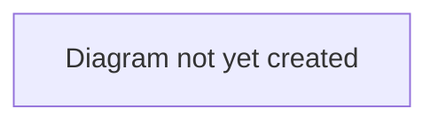

# TransferX Product Specification

## Purpose

This is the master entry point for TransferX's documentation. It gives a short, accurate description of what the product currently is, then indexes every other document in the set. Read this first — everything else is one or two links away.

This document is intentionally an **outline with pointers**, not the content itself. Detailed information lives in the linked documents, each with a single responsibility, so that updating one fact only requires editing one place.

## Scope

In scope: what TransferX is today (grounded in the current codebase), and a map of where to find everything else.
Out of scope: implementation detail (see `architecture/` and `engineering/`), day-to-day backlog (see [Roadmap](./product/roadmap.md) and Linear), business strategy detail (see `business/`).

## Table of Contents

- [What TransferX is](#what-transferx-is)
- [Current state](#current-state)
- [Documentation map](#documentation-map)
  - [Business](#business)
  - [Product](#product)
  - [Architecture](#architecture)
  - [Engineering](#engineering)
  - [Operations](#operations)
  - [Security & Compliance](#security--compliance)
  - [Tracking documents](#tracking-documents)
- [System diagram](#system-diagram)
- [Related documents](#related-documents)

## What TransferX is

TransferX is a web platform for football (soccer) player transfers. It connects **selling clubs**, **buying clubs**, **agents**, and **players** around a structured deal lifecycle: a club lists a player (auction, fixed price, or open to offers), other clubs bid or make offers, terms are negotiated, an agent (where the player has one) negotiates commission and personal terms, and the deal proceeds through a staged approval process to completion.

> **TODO:** Replace this paragraph with an approved product description once one exists in `business/vision.md`. This paragraph is derived directly from the current codebase (see `architecture/backend-architecture.md`) and should stay accurate to what's actually built, not aspirational.

## Current state

| Fact | Value | Source |
|---|---|---|
| Backend | FastAPI (Python), SQLAlchemy async, PostgreSQL | [`architecture/backend-architecture.md`](./architecture/backend-architecture.md) |
| Frontend | React 19, Vite, TypeScript, Tailwind CSS v4 | [`architecture/frontend-architecture.md`](./architecture/frontend-architecture.md) |
| Database migrations | 47+ (Alembic) | [`engineering/database-migrations.md`](./engineering/database-migrations.md) |
| User types | Club, Agent, Player, Staff, Admin | [`product/personas.md`](./product/personas.md) |
| Deal stages | AGREEMENT → AGENT_NEGOTIATION → PERSONAL_TERMS → PAPERWORK → CONFIRMED → COMPLETED (or COLLAPSED) | [`product/workflows/transfer-lifecycle.md`](./product/workflows/transfer-lifecycle.md) |
| Production deployment | Not yet configured | [`operations/environments-and-deployment.md`](./operations/environments-and-deployment.md) |

> **TODO:** Keep this table in sync as the product evolves. It should always reflect *current, verified* state — if you're not sure a row is still accurate, check the code before trusting it.

## Documentation map

### Business
*Why the business exists, who it serves commercially, how it makes money.*

- [`business/README.md`](./business/README.md) — area overview
- [`business/vision.md`](./business/vision.md) — mission, problem statement
- [`business/target-users-and-market.md`](./business/target-users-and-market.md) — market and segment
- [`business/business-model.md`](./business/business-model.md) — pricing and monetization
- [`business/glossary.md`](./business/glossary.md) — canonical definitions of domain terms

### Product
*What to build, for which users, in what order — not how it's implemented.*

- [`product/README.md`](./product/README.md) — area overview
- [`product/roadmap.md`](./product/roadmap.md) — phased plan and links to the live backlog
- [`product/personas.md`](./product/personas.md) — who uses TransferX and in what role
- [`product/workflows/`](./product/workflows/README.md) — user-journey-level descriptions of core flows
  - [Transfer lifecycle](./product/workflows/transfer-lifecycle.md)
  - [Negotiation & offers](./product/workflows/negotiation-and-offers.md)
  - [Agent representation](./product/workflows/agent-representation.md)
  - [Deal completion](./product/workflows/deal-completion.md)
- [`product/decisions/`](./product/decisions/README.md) — record of significant product decisions

### Architecture
*How the system is designed.*

- [`architecture/README.md`](./architecture/README.md) — area overview
- [`architecture/system-overview.md`](./architecture/system-overview.md) — high-level system diagram and stack
- [`architecture/backend-architecture.md`](./architecture/backend-architecture.md) — FastAPI module layout
- [`architecture/frontend-architecture.md`](./architecture/frontend-architecture.md) — React app structure
- [`architecture/data-model.md`](./architecture/data-model.md) — core entities and relationships
- [`architecture/authentication-and-permissions.md`](./architecture/authentication-and-permissions.md) — how auth/authorization is implemented
- [`architecture/decisions/`](./architecture/decisions/README.md) — architecture decision records (ADRs)

### Engineering
*How to build, test, and work in this codebase day to day.*

- [`engineering/README.md`](./engineering/README.md) — area overview
- [`engineering/getting-started.md`](./engineering/getting-started.md) — local environment setup
- [`engineering/coding-standards.md`](./engineering/coding-standards.md) — conventions and style
- [`engineering/testing-strategy.md`](./engineering/testing-strategy.md) — how testing works and what's covered
- [`engineering/database-migrations.md`](./engineering/database-migrations.md) — Alembic workflow
- [`engineering/api-reference.md`](./engineering/api-reference.md) — where the API reference lives

### Operations
*How TransferX runs in production.*

- [`operations/README.md`](./operations/README.md) — area overview
- [`operations/environments-and-deployment.md`](./operations/environments-and-deployment.md) — environments and how deploys work
- [`operations/monitoring-and-observability.md`](./operations/monitoring-and-observability.md) — logging, metrics, alerting
- [`operations/incident-response.md`](./operations/incident-response.md) — what to do when something breaks

### Security & Compliance
*What's protected, what isn't, and what the legal exposure is.*

- [`security-and-compliance/README.md`](./security-and-compliance/README.md) — area overview
- [`security-and-compliance/permissions-model.md`](./security-and-compliance/permissions-model.md) — confidentiality and access posture
- [`security-and-compliance/data-privacy-and-legal.md`](./security-and-compliance/data-privacy-and-legal.md) — privacy and legal surface

### Tracking documents
*Root-level documents that track ongoing state rather than belonging to one area — see [`README.md#tracking-documents`](./README.md#tracking-documents) for the full explanation.*

- [`CHANGELOG.md`](./CHANGELOG.md) — chronological record of what changed
- [`IMPLEMENTATION_STATUS.md`](./IMPLEMENTATION_STATUS.md) — current build status, verified against code
- [`SESSION_HANDOVER.md`](./SESSION_HANDOVER.md) — the current handover note for the next working session

## System diagram

> **TODO:** Add a top-level system diagram (clients → API → database → external integrations) once reviewed. See [`architecture/system-overview.md`](./architecture/system-overview.md) for the detailed version this should summarize.

## Related documents

- [`docs/README.md`](./README.md) — documentation conventions and structure (read this if you're adding new docs)
- [`../.claude/skills/`](../.claude/skills/) — the five Claude Code project skills that encode this documentation system's conventions, plus engineering, product, and backlog standards, as procedural guidance
