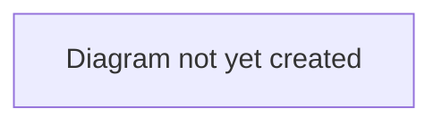

# TransferX Documentation

## Purpose

This is the root of TransferX's documentation system. It explains how the documentation is organized, the conventions every document follows, and where new information should go as the project grows.

This file describes the *system*, not the product. For the product itself, start at **[PRODUCT_SPEC.md](./PRODUCT_SPEC.md)**.

## Scope

In scope: documentation structure, conventions, and contribution rules.
Out of scope: any actual product, business, or technical content — that lives in the six areas below.

## Table of Contents

- [How the documentation is organized](#how-the-documentation-is-organized)
- [For AI assistants](#for-ai-assistants-including-claude-code)
- [Conventions](#conventions)
- [Where to add new documentation](#where-to-add-new-documentation)
- [Related documents](#related-documents)

## How the documentation is organized

Documentation is split into six areas, each with a single responsibility. Business context is separated from technical detail; product planning is separated from implementation.

| Area | Answers | Audience |
|---|---|---|
| [`business/`](./business/README.md) | Why does this product exist? Who is it for, commercially? | Founders, leadership, new hires |
| [`product/`](./product/README.md) | What are we building, for which users, in what order? | Product, design, engineering leads |
| [`architecture/`](./architecture/README.md) | How is the system designed? | Engineers, technical reviewers |
| [`engineering/`](./engineering/README.md) | How do I work in this codebase day to day? | Contributors (human and AI) |
| [`operations/`](./operations/README.md) | How do we run this in production? | On-call, DevOps |
| [`security-and-compliance/`](./security-and-compliance/README.md) | What's protected, what isn't, what's the legal exposure? | Security, legal, auditors |
| [`feature_spec/`](./feature_spec/README.md) | What exactly should the next build deliver, in implementable detail? | Implementing engineers (human and AI) |

Each area has its own `README.md` explaining its own scope in more detail. [`PRODUCT_SPEC.md`](./PRODUCT_SPEC.md) is the master index that links into all six.

### Tracking documents

Alongside the six areas, a small set of root-level documents track ongoing state rather than belonging to any one area:

| Document | Answers |
|---|---|
| [`PRODUCT_SPEC.md`](./PRODUCT_SPEC.md) | What is TransferX, and where is everything else? (master index) |
| [`CHANGELOG.md`](./CHANGELOG.md) | What changed, in order, over time? |
| [`IMPLEMENTATION_STATUS.md`](./IMPLEMENTATION_STATUS.md) | What's actually built right now, verified against the code? |
| [`SESSION_HANDOVER.md`](./SESSION_HANDOVER.md) | What should the next working session know before starting? |

These four have a different update rhythm than the six content areas — see the [`documentation-standards`](../.claude/skills/documentation-standards/SKILL.md) and [`session-lifecycle`](../.claude/skills/session-lifecycle/SKILL.md) skills for exactly when and how each gets updated.

## For AI assistants (including Claude Code)

If you are an AI coding assistant working in this repository:

1. Start at [`PRODUCT_SPEC.md`](./PRODUCT_SPEC.md) to orient yourself, then follow links into the relevant area.
2. **Don't duplicate information.** If a fact belongs in another document, link to it instead of copying it. Duplicate facts drift out of sync.
3. **Verify before trusting.** Documentation can go stale. If a doc's claim about the code looks wrong, check the code, then fix the doc.
4. When you edit a document, update its `last_updated` field to the current date.
5. When you add a new document, give it front matter (below), add it to its area's `README.md` table of contents, and link it from anything it relates to.
6. Prefer filling in a `TODO` over leaving a document silent on something you don't know — but don't invent facts to fill a TODO. Leave it as a TODO if you're not sure.
7. This repository also defines five **Claude Code project skills** under [`.claude/skills/`](../.claude/skills/) — `documentation-standards`, `engineering-standards`, `linear-workflow`, `product-principles`, and `session-lifecycle`. They encode most of what this file says procedurally and will often trigger automatically based on what you're doing; you can also invoke one directly if you know which applies.

## Conventions

### Front matter

Every document starts with:

```yaml
---
title: "Document Title"
last_updated: YYYY-MM-DD
status: Draft | Active | Deprecated
owner: "Name/role, or TODO if unassigned"
---
```

- **Draft** — initial scaffold or actively being written; not yet authoritative.
- **Active** — current and maintained; treat as the source of truth.
- **Deprecated** — superseded; kept for history, links to its replacement.

### TODO markers

Unknown or undecided information is marked as a blockquote so it's easy to find and grep:

```markdown
> **TODO:** What needs to be decided or filled in, and by whom if known.
```

Find every open TODO with: `grep -rn "TODO:" docs/`

### Mermaid diagrams

Where a diagram will eventually explain a workflow or architecture, a placeholder fenced block is used so the document still renders cleanly:

````markdown

````

### Cross-links

Always link with relative paths (e.g. `../architecture/data-model.md`) so links survive if the repo is renamed or mirrored.

## Where to add new documentation

Ask what kind of question the new document answers:

- Commercial, market, or strategic → `business/`
- What to build / for whom / in what order → `product/` (a specific user journey → `product/workflows/`)
- How the system is designed → `architecture/` (a significant, hard-to-reverse design choice → `architecture/decisions/`)
- How to build/test/run it locally → `engineering/`
- How it runs in production → `operations/`
- Confidentiality, permissions posture, legal/compliance → `security-and-compliance/`

If a new document doesn't fit any of these, that's a signal the taxonomy itself may need to grow — raise it rather than force-fitting.

## Related Documents

- [PRODUCT_SPEC.md](./PRODUCT_SPEC.md) — master index
