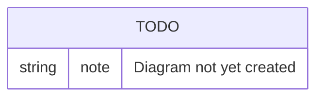

# Data Model

## Purpose

Documents TransferX's core entities and how they relate to each other. This is the technical counterpart to [`../business/glossary.md`](../business/glossary.md) — that document defines terms in plain language; this one defines them as data.

## Scope

In scope: core entity list and relationships.
Out of scope: full column-level schema (the migrations under `backend/migrations/versions/` are the source of truth for that), business definitions of these terms (see [`../business/glossary.md`](../business/glossary.md)).

## Table of Contents

- [Core entities](#core-entities)
- [Diagram](#diagram)
- [Related documents](#related-documents)

## Core entities

| Entity | Owned by module | Notes |
|---|---|---|
| `User` | `auth` | Base account; typed as Club / Agent / Player / Staff / Admin |
| `Club`, `ClubFinance`, `ClubStaff` | `clubs` | Club profile and budget tracking (reserved/committed/spent) |
| `Player`, `Contract` | `players` | Player record and contract history |
| `Sale`, `Bid` | `sales` | Listings and auction bids |
| `Offer` | `offers` | Direct offers and counters |
| `Deal`, `DealClause`, `DealInstalment`, `PersonalTerms`, `MedicalCheck` | `deals` | Deal lifecycle and its sub-records |
| `AgentProfile`, `Mandate`, `AgentNegotiation` | `agents` / `mandates` | Agent representation and negotiation |
| `Notification` | `notifications` | In-app/email notifications |
| `AuditEvent` | `audit` | Append-only audit trail |

> **TODO:** This table is a starting point, not exhaustive. Expand it as entities are added, and correct it if any entry above is inaccurate — verify against `backend/app/*/models.py` rather than assuming.

## Diagram

> **TODO:** Add an entity-relationship diagram covering the core entities above.

## Related documents

- [`../business/glossary.md`](../business/glossary.md) — plain-language definitions of these entities
- [`backend-architecture.md`](./backend-architecture.md) — which module owns each entity
- [`../engineering/database-migrations.md`](../engineering/database-migrations.md) — how the schema evolves over time
