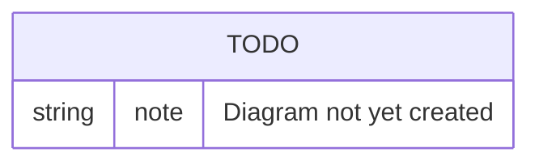

# Data Model

## Purpose

Documents TransferX's core entities and how they relate to each other. This is the technical counterpart to [`../business/glossary.md`](../business/glossary.md) — that document defines terms in plain language; this one defines them as data.

## Scope

In scope: core entity list and relationships.
Out of scope: full column-level schema (the migrations under `backend/migrations/versions/` are the source of truth for that), business definitions of these terms (see [`../business/glossary.md`](../business/glossary.md)).

## Table of Contents

- [Core entities](#core-entities)
- [Diagram](#diagram)
- [Related documents](#related-documents)

## Core entities

| Entity | Owned by module | Notes |
|---|---|---|
| `User` | `auth` | Base account; typed as Club / Agent / Player / Staff / Admin |
| `Club`, `ClubFinance`, `ClubStaff` | `clubs` | Club profile and budget tracking (reserved/committed/spent); `ClubFinance.approval_threshold` (null = approvals off); `ClubStaff.role` is one of four staff roles (TRA-151) |
| `ClubStaffInvitation` | `clubs` | Tokenised staff invitation (TRA-86): sha256 `token_hash` only — the raw token is never stored; expires/revoked/accepted timestamps make it single-use |
| `PendingApproval` | `approvals` | A captured money action awaiting sign-off (Phase 5): validated `payload_json` replayed at execution, requester + decider both recorded, one-way status machine |
| `Player`, `Contract` | `players` | Player record and contract history |
| `Sale`, `Bid` | `sales` | Listings and auction bids |
| `Offer` | `offers` | Direct offers and counters |
| `Deal`, `DealClause`, `DealInstalment`, `PersonalTerms`, `MedicalCheck` | `deals` | Deal lifecycle and its sub-records. `Deal` gained `fee_disclosed` (public-feed opt-out), `confirmed_at` (set on `PAPERWORK → CONFIRMED`, drives the transfer-window deadline-day grace period), `option_exercised` (one-shot guard for a loan's purchase option), and `seller_wage_contribution_weekly` (loans) in the 2026-07-11/12 audit remediation. `MedicalCheck.status` gained `WAIVED` (buying club explicitly proceeds with no medical) alongside `PENDING`/`PASSED`/`FAILED`. |
| `AgentProfile`, `Mandate`, `AgentNegotiation` | `agents` / `mandates` | Agent representation and negotiation |
| `TransferWindow` | `transfer_window` | An open/close date range clubs may transact within, scoped by `association` (null = global, applies to all clubs; set = that association's clubs plus global windows) with a per-window `grace_period_hours` for completing an already-`CONFIRMED` deal after the window closes |
| `Notification` | `notifications` | In-app/email notifications |
| `AuditEvent` | `audit` | Append-only audit trail |
| `PlayerValuation` | `valuation` | Append-only fair-value model history (TRA-91); latest = max `computed_at` per player; `inputs_json` snapshots every input so any historical number is explainable |

> **TODO:** This table is a starting point, not exhaustive. Expand it as entities are added, and correct it if any entry above is inaccurate — verify against `backend/app/*/models.py` rather than assuming.

## Diagram

> **TODO:** Add an entity-relationship diagram covering the core entities above.

## Related documents

- [`../business/glossary.md`](../business/glossary.md) — plain-language definitions of these entities
- [`backend-architecture.md`](./backend-architecture.md) — which module owns each entity
- [`../engineering/database-migrations.md`](../engineering/database-migrations.md) — how the schema evolves over time
