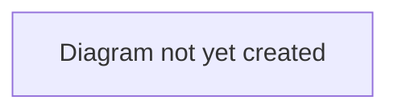

# System Overview

## Purpose

A high-level picture of TransferX's stack and how its pieces fit together — the entry point for understanding the system before diving into [`backend-architecture.md`](./backend-architecture.md) or [`frontend-architecture.md`](./frontend-architecture.md).

## Scope

In scope: the overall stack, services, and how they communicate.
Out of scope: module-level detail (see `backend-architecture.md` / `frontend-architecture.md`), entity-level detail (see [`data-model.md`](./data-model.md)).

## Table of Contents

- [Stack](#stack)
- [Services](#services)
- [Diagram](#diagram)
- [Related documents](#related-documents)

## Stack

| Layer | Technology |
|---|---|
| Backend | FastAPI (Python), SQLAlchemy (async), Alembic migrations |
| Frontend | React 19, Vite, TypeScript, Tailwind CSS v4 |
| Database | PostgreSQL |
| Real-time updates | WebSocket (`/ws`) |
| Background jobs | APScheduler (in-process) |

## Services

Local development runs three services via Docker Compose:

| Service | Purpose |
|---|---|
| `db` | PostgreSQL |
| `api` | FastAPI backend |
| `frontend` | React app (Vite dev server) |

> **TODO:** Document the production topology once it exists — see [`../operations/environments-and-deployment.md`](../operations/environments-and-deployment.md), which currently notes that a production environment is not yet configured.

## Diagram

> **TODO:** Add a diagram showing frontend → API → database, plus external integrations (see [`backend-architecture.md`](./backend-architecture.md) for the vendor/enrichment modules this should include).

## Related documents

- [`backend-architecture.md`](./backend-architecture.md) — backend module detail
- [`frontend-architecture.md`](./frontend-architecture.md) — frontend structure detail
- [`../engineering/getting-started.md`](../engineering/getting-started.md) — how to run this stack locally
