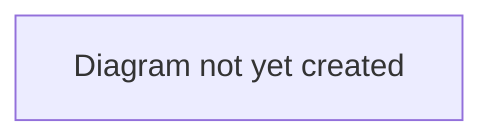

# Workflow: Agent Representation

## Purpose

Describes how an agent's representation of a player (a mandate) affects and participates in the deal lifecycle.

## Scope

In scope: mandates, the three-way agent negotiation (agent ↔ buying club on commission, agent ↔ player on personal terms), and how these connect to the wider deal.
Out of scope: the rest of the deal lifecycle outside the agent-negotiation stage (see [`transfer-lifecycle.md`](./transfer-lifecycle.md)).

## Table of Contents

- [Mandates](#mandates)
- [Agent negotiation](#agent-negotiation)
- [Diagram](#diagram)
- [Related documents](#related-documents)

## Mandates

A mandate is the formal relationship between an agent and a player — it establishes who represents whom, whether exclusively, and for how long.

> **TODO:** Describe how a mandate is established and what it authorizes the agent to do on the player's behalf.

## Agent negotiation

When a deal reaches the `AGENT_NEGOTIATION` stage (see [`transfer-lifecycle.md`](./transfer-lifecycle.md)), the mandated agent negotiates two things in parallel:

- **Commission terms** with the buying club (percentage, flat amount, and who pays it).
- **Personal terms** with the player (wage, signing bonus, contract length).

Both sides must agree before the deal can advance.

> **TODO:** Describe the negotiation journey in more detail — what each party sees, how messages/counter-proposals work, and what happens if either side declines.

## Diagram

> **TODO:** Add a diagram showing the three-way relationship (buying club ↔ agent ↔ player) during this stage.

## Related documents

- [`transfer-lifecycle.md`](./transfer-lifecycle.md) — where this stage fits in the overall deal
- [`deal-completion.md`](./deal-completion.md) — what happens after agent negotiation concludes
- [`../../business/glossary.md`](../../business/glossary.md) — definition of Mandate
