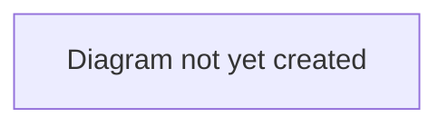

# Workflow: Agent Representation

## Purpose

Describes how an agent's representation of a player (a mandate) affects and participates in the deal lifecycle.

## Scope

In scope: mandates, the agent's commission negotiation with the buying club, and how these connect to the wider deal.
Out of scope: personal terms, which are captured once at `PERSONAL_TERMS` regardless of whether a mandate exists (see [`transfer-lifecycle.md`](./transfer-lifecycle.md) and [ADR 0002](../decisions/0002-single-capture-point-for-personal-terms.md)); the rest of the deal lifecycle outside the agent-negotiation stage (see [`transfer-lifecycle.md`](./transfer-lifecycle.md)).

## Table of Contents

- [Mandates](#mandates)
- [Agent negotiation](#agent-negotiation)
- [Diagram](#diagram)
- [Related documents](#related-documents)

## Mandates

A mandate is the formal relationship between an agent and a player — it establishes who represents whom, whether exclusively, and for how long.

> **TODO:** Describe how a mandate is established and what it authorizes the agent to do on the player's behalf.

## Agent negotiation

When a deal reaches the `AGENT_NEGOTIATION` stage (see [`transfer-lifecycle.md`](./transfer-lifecycle.md)), the mandated agent negotiates **commission terms** with the buying club — percentage, flat amount (auto-derived from the percentage against the deal's agreed fee if only a percentage is given), and who pays it.

As of [ADR 0002](../decisions/0002-single-capture-point-for-personal-terms.md), this stage no longer also negotiates personal terms — those are captured once, at `PERSONAL_TERMS`, whether or not an agent is involved. The agent still runs that step too when mandated (proposing terms via `set_personal_terms`), it's just a separate stage rather than a parallel track here.

The club must agree before the deal can advance; declining collapses the deal.

> **TODO:** Describe the negotiation journey in more detail — what each party sees, how messages/counter-proposals work.

## Diagram

> **TODO:** Add a diagram showing the three-way relationship (buying club ↔ agent ↔ player) during this stage.

## Related documents

- [`transfer-lifecycle.md`](./transfer-lifecycle.md) — where this stage fits in the overall deal
- [`deal-completion.md`](./deal-completion.md) — what happens after agent negotiation concludes
- [`../../business/glossary.md`](../../business/glossary.md) — definition of Mandate
