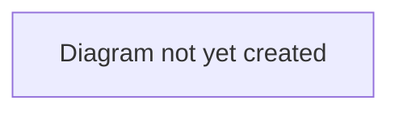

# Workflow: Deal Completion

## Purpose

Describes the final stages of a deal — from agreed personal terms through to a completed transfer.

## Scope

In scope: the `PAPERWORK` → `CONFIRMED` → `COMPLETED` stages, medical checks, and what happens on completion (contract handover, finance settlement).
Out of scope: earlier stages (see [`transfer-lifecycle.md`](./transfer-lifecycle.md) and [`agent-representation.md`](./agent-representation.md)).

## Table of Contents

- [Paperwork stage](#paperwork-stage)
- [Medical check](#medical-check)
- [Completion](#completion)
- [Diagram](#diagram)
- [Related documents](#related-documents)

## Paperwork stage

> **TODO:** Describe what happens during the paperwork stage, who is responsible for progressing it, and what a club/agent/player sees while a deal is here.

## Medical check

A deal can carry a medical check record (pass/fail), recorded by platform staff.

> **TODO:** Describe the intended real-world process this represents, and current known limitations (e.g. whether an incomplete medical currently blocks completion) — see [`../../security-and-compliance/README.md`](../../security-and-compliance/README.md) if there are confidentiality considerations to flag here rather than duplicate.

## Completion

On completion, the player's contract moves to the buying club and the transfer fee is settled between both clubs' finances.

> **TODO:** Describe what changes for each party the moment a deal completes (player, both clubs, agent commission).

## Diagram

> **TODO:** Add a diagram of the paperwork → confirmed → completed sequence, including the medical-check gate.

## Related documents

- [`transfer-lifecycle.md`](./transfer-lifecycle.md) — the full lifecycle this is the end of
- [`agent-representation.md`](./agent-representation.md) — the stage immediately before this one (where a mandate exists)
- [`../../architecture/data-model.md`](../../architecture/data-model.md) — how completion affects underlying data (contracts, finance)
