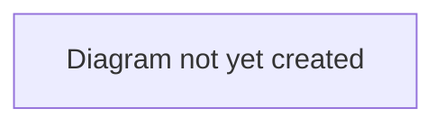

# Workflow: Deal Completion

## Purpose

Describes the final stages of a deal — from agreed personal terms through to a completed transfer.

## Scope

In scope: the `PAPERWORK` → `CONFIRMED` → `COMPLETED` stages, medical checks, and what happens on completion (contract handover, finance settlement).
Out of scope: earlier stages (see [`transfer-lifecycle.md`](./transfer-lifecycle.md) and [`agent-representation.md`](./agent-representation.md)).

## Table of Contents

- [Paperwork stage](#paperwork-stage)
- [Medical check](#medical-check)
- [Completion](#completion)
- [Diagram](#diagram)
- [Related documents](#related-documents)

## Paperwork stage

**Verified 2026-07-04.** Advancing `PAPERWORK → CONFIRMED` is staff-only — any account with `is_superuser` set, whether or not it also happens to be a club (clubs and agents get a 403 if they try). Buyer and seller clubs see a passive "TransferX is handling the paperwork" banner with nothing actionable; there is currently no equivalent banner for the agent or player, who just see the deal's read-only state. Progressing this stage is a plain `POST /deals/{id}/advance`, the same endpoint used for every other stage transition — there is no dedicated "paperwork review" UI, only the [admin panel](../../architecture/frontend-architecture.md)'s generic Advance action.

## Medical check

**Verified 2026-07-05.** A deal can carry one medical check record, written via `PUT /deals/{id}/medical-check` (staff only) with a status and free-text notes. Only a `FAILED` status blocks `PAPERWORK → CONFIRMED`; no medical check at all (the common case) does not block progression. `DealDetailPage` shows a Medical Check panel to every deal participant (status, notes, last-updated); staff additionally get an inline control to set or update it, with a note when a `FAILED` status is currently blocking progression.

## Completion

`CONFIRMED → COMPLETED` can be triggered by a club (any deal participant) or staff, via the same generic advance action — the buyer/seller banner at this stage reads "ready to execute" with an **Execute Transfer** button. On completion:

- The player's active contract moves to the buying club (a new `Contract` row; wage per the deal's agreed terms).
- The buyer's committed transfer/wage budget converts to spent; the seller's finance is credited the agreed fee.
- The player's `open_to_offers` flag is cleared (belongs to the seller's context — the new owner decides fresh).
- Any `PENDING` `AgentCommission` for the deal moves to `CONFIRMED` (the agent's commission is due, but not yet invoiced or paid — see [`agent-representation.md`](./agent-representation.md)).
- A `DEAL_COMPLETED` event is recorded in the deal's audit log (see [`../../architecture/data-model.md`](../../architecture/data-model.md) for the audit-log schema).

## Diagram

> **TODO:** Add a diagram of the paperwork → confirmed → completed sequence, including the medical-check gate.

## Related documents

- [`transfer-lifecycle.md`](./transfer-lifecycle.md) — the full lifecycle this is the end of
- [`agent-representation.md`](./agent-representation.md) — the stage immediately before this one (where a mandate exists)
- [`../../architecture/data-model.md`](../../architecture/data-model.md) — how completion affects underlying data (contracts, finance)
