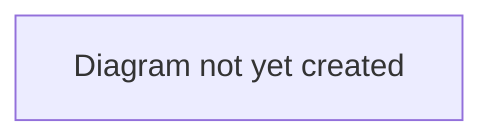

# Workflow: Deal Completion

## Purpose

Describes the final stages of a deal — from agreed personal terms through to a completed transfer.

## Scope

In scope: the `PAPERWORK` → `CONFIRMED` → `COMPLETED` stages, medical checks, and what happens on completion (contract handover, finance settlement).
Out of scope: earlier stages (see [`transfer-lifecycle.md`](./transfer-lifecycle.md) and [`agent-representation.md`](./agent-representation.md)).

## Table of Contents

- [Paperwork stage](#paperwork-stage)
- [Medical check](#medical-check)
- [Completion](#completion)
- [Diagram](#diagram)
- [Related documents](#related-documents)

## Paperwork stage

**Verified 2026-07-04.** Advancing `PAPERWORK → CONFIRMED` is staff-only — any account with `is_superuser` set, whether or not it also happens to be a club (clubs and agents get a 403 if they try). Buyer and seller clubs see a passive "TransferX is handling the paperwork" banner with nothing actionable; there is currently no equivalent banner for the agent or player, who just see the deal's read-only state. Progressing this stage is a plain `POST /deals/{id}/advance`, the same endpoint used for every other stage transition — there is no dedicated "paperwork review" UI, only the [admin panel](../../architecture/frontend-architecture.md)'s generic Advance action.

> **Known gap:** club legal has no seat in this stage — no document checklist, no club-side sign-off, no e-signature. Every deal requires TransferX staff to progress it. See [`audits/2026-07-12-transfer-workflow-audit.md`](../../audits/2026-07-12-transfer-workflow-audit.md) M3.

This stage also gates on the medical check and, at completion, the transfer window — see below.

## Medical check

**Verified 2026-07-12** (reworked in the 2026-07-11/12 audit remediation — supersedes the earlier staff-only model). A deal carries one medical check record, written via `PUT /deals/{id}/medical-check` by the **buying club** (their medical team conducted it, not TransferX) or platform staff — status is `PENDING`, `PASSED`, `FAILED`, or `WAIVED`, plus free-text notes.

- `PAPERWORK → CONFIRMED` now requires a recorded outcome: a missing or still-`PENDING` record blocks, the same as `FAILED`. `WAIVED` lets the buying club explicitly proceed with no medical (e.g. a deadline-day loan with no time for one) — it counts the same as `PASSED` for gating purposes.
- `FAILED` also blocks `CONFIRMED → COMPLETED` — a medical that fails *after* confirmation (but before execution) still stops the transfer.
- The **selling club cannot see the medical at all** — status, notes, and even whether a record exists are hidden from them in every deal response. Medical data is special-category personal data (GDPR); it's also a negotiation-leverage problem if the seller could read the buyer's findings about a player they no longer control.
- `staff_complete` (the staff force-complete override) does **not** require a recorded medical — only a `FAILED` one still blocks it. This is deliberate, not an oversight — see [ADR 0001](../../architecture/decisions/0001-staff-overrides-bypass-completion-gates.md).

`DealDetailPage` shows a Medical Check panel; the buyer's inline control to set/update it, and the seller-hidden state, should be re-verified against the current backend contract the next time this UI is touched — the last live-stack verification predates the buyer-recording change.

## Completion

`CONFIRMED → COMPLETED` can be triggered by a club (any deal participant) or staff, via the same generic advance action — the buyer/seller banner at this stage reads "ready to execute" with an **Execute Transfer** button.

**Verified 2026-07-12.** Completion is now window-gated: it checks the buying club's association against the transfer-window calendar (see [`negotiation-and-offers.md`](./negotiation-and-offers.md) for where windows are enforced earlier in the flow). To avoid blocking a deal that was legitimately agreed while the window was open, a **deadline-day grace period** applies: the moment a deal reaches `CONFIRMED` its `confirmed_at` timestamp is recorded ("the deal sheet was filed"), and it may still complete for that window's `grace_period_hours` (configurable per window, default 24h) after the window closes. `staff_complete` bypasses this check entirely, same as the medical gate above.

On completion:

- The player's active contract moves to the buying club (a new `Contract` row; wage and end date come from the player's consented `PersonalTerms` — `wage_weekly` and `length_years` — not the original club-to-club bid/offer figure). For a `LOAN` deal with a `seller_wage_contribution_weekly` set, the buyer's wage-budget accounting nets that contribution off before reserving.
- The buyer's committed transfer/wage budget converts to spent; the seller's finance is credited the agreed fee (or, for a `LOAN`, the `loan_fee` if set).
- If a prior completed deal for this player had a `sell_on_pct`, the resale now creates a tracked `RESALE` `DealClause` on this deal recording the obligation, and notifies the original selling club.
- The player's `open_to_offers` flag is cleared (belongs to the seller's context — the new owner decides fresh).
- Any `PENDING` `AgentCommission` for the deal moves to `CONFIRMED` (the agent's commission is due, but not yet invoiced or paid — see [`agent-representation.md`](./agent-representation.md)).
- A `DEAL_COMPLETED` event is recorded in the deal's audit log (see [`../../architecture/data-model.md`](../../architecture/data-model.md) for the audit-log schema).

> **Known gap:** the `RESALE` clause above is created on the *new* deal, but its beneficiary is the *original* selling club — who isn't a party to that deal and can't read the record tracking money owed to them. See [`audits/2026-07-12-transfer-workflow-audit.md`](../../audits/2026-07-12-transfer-workflow-audit.md) M5.

### Loan-specific completion

A completed `LOAN` deal is not the end of the story:

- A daily background job (`loan_expiry`) notifies both clubs once `loan_end` has passed — it does not itself return the player; the borrowing club's contract stays active until a follow-on action is taken.
- `POST /deals/{id}/exercise-option` lets the loaning club convert a completed loan into a new `PERMANENT` deal at the agreed `option_to_buy` price, starting fresh at `AGREEMENT` (so the player still goes through personal-terms consent for the permanent contract). One-shot per loan (`Deal.option_exercised`), blocked if the player already has another active deal in progress, and subject to the same transfer-window check as any other deal-creating action.
- `obligation_to_buy` is recorded but not evaluated — its `obligation_conditions` are free text with no automatic trigger.

### Fee disclosure

Every deal has a `fee_disclosed` flag (default `true`), togglable by either deal party at any stage — even after completion — via `PATCH /deals/{id}`. The public transfer feed (`GET /transfers`, `/transfers/analytics`) nulls `agreed_fee` for undisclosed deals; aggregate sums still include them, but per-deal figures don't leak.

> **Known gap:** an undisclosed deal can still leak by *ranking* — it can appear as e.g. the publicly-listed "#1 transfer" with a null fee, revealing that it was large even without the number. See [`audits/2026-07-12-transfer-workflow-audit.md`](../../audits/2026-07-12-transfer-workflow-audit.md) Medium 4. Also, `fee_disclosed` can currently be toggled by either party unilaterally — see the same audit's M1 (unilateral financial actions).

## Diagram

> **TODO:** Add a diagram of the paperwork → confirmed → completed sequence, including the medical-check gate.

## Related documents

- [`transfer-lifecycle.md`](./transfer-lifecycle.md) — the full lifecycle this is the end of
- [`negotiation-and-offers.md`](./negotiation-and-offers.md) — where transfer windows are also enforced, earlier in the flow
- [`agent-representation.md`](./agent-representation.md) — the stage immediately before this one (where a mandate exists)
- [`../../architecture/data-model.md`](../../architecture/data-model.md) — how completion affects underlying data (contracts, finance)
- [`../../architecture/decisions/0001-staff-overrides-bypass-completion-gates.md`](../../architecture/decisions/0001-staff-overrides-bypass-completion-gates.md) — why `staff_complete` isn't subject to the medical/window gates above
- [`../../security-and-compliance/permissions-model.md`](../../security-and-compliance/permissions-model.md) — the medical-check confidentiality boundary
- [`../../audits/2026-07-12-transfer-workflow-audit.md`](../../audits/2026-07-12-transfer-workflow-audit.md) — the re-audit this document's "Known gap" notes are drawn from
