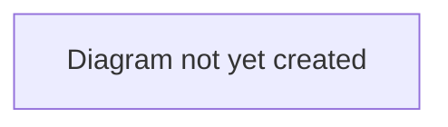

# Workflow: Deal Completion

## Purpose

Describes the final stages of a deal — from agreed personal terms through to a completed transfer.

## Scope

In scope: the `PAPERWORK` → `CONFIRMED` → `COMPLETED` stages, medical checks, and what happens on completion (contract handover, finance settlement).
Out of scope: earlier stages (see [`transfer-lifecycle.md`](./transfer-lifecycle.md) and [`agent-representation.md`](./agent-representation.md)).

## Table of Contents

- [Paperwork stage](#paperwork-stage)
- [Medical check](#medical-check)
- [Completion](#completion)
- [Diagram](#diagram)
- [Related documents](#related-documents)

## Paperwork stage

**Changed 2026-09-27: the clubs run the paperwork themselves.** Until then it was staff-only: every deal waited for TransferX to move it on. The deal page now shows a checklist:

| Step | Who |
|---|---|
| Sign the transfer agreement | Buying club |
| Sign the transfer agreement | Selling club (no step when there is no selling club, e.g. a free-agent signing) |
| Record a passed medical | Buying club (see below) |
| Submit the registration | Buying club |

Each club ticks only its own steps (`POST /deals/{id}/paperwork/sign-agreement`, `…/submit-registration`), each tick is confirmed in the UI, recorded on the audit trail, and notified to the other club (`DEAL_PAPERWORK`). **The last step moves the deal to `CONFIRMED` by itself**; there is no separate advance. A club pressing the generic advance at this stage is refused with a pointer to the checklist. Outstanding steps show as "your move" on the owning club's dashboard, in the sidebar count and in the daily digest. Staff can still advance the deal directly as an override (disputes, stuck deals). Migration `0077`.

## Medical check

A deal carries one medical check record: a status and free-text notes, via `PUT /deals/{id}/medical-check`. **The buying club records it while the deal is at `PAPERWORK`**, since it runs the medical; staff can record it at any time. A `PASSED` medical is a checklist step and may be the one that confirms the deal. A `FAILED` one stops the deal moving on until a new result is recorded, or the deal is collapsed. Before 2026-09-27 the medical was staff-only, and a deal with no medical at all could be confirmed.

## Completion

`CONFIRMED → COMPLETED` can be triggered by a club (any deal participant) or staff, via the same generic advance action — the buyer/seller banner at this stage reads "ready to execute" with an **Execute Transfer** button. On completion:

- The player's active contract moves to the buying club (a new `Contract` row) on **the personal terms he consented to**: that wage, starting today and ending after the agreed number of years. Before 2026-09-27 the contract took the offer's opening wage and had no end date.
- The buyer's committed transfer/wage budget converts to spent, including the signing bonus; the seller's finance is credited the agreed fee (or per instalment, as each is marked paid, when there is a schedule).
- The add-ons' hold on the buyer's budget is released. They were reserved and committed so the club could pay them if they fell due; from completion they are tracked per clause.
- The player's `open_to_offers` flag is cleared (belongs to the seller's context — the new owner decides fresh).
- Any `PENDING` `AgentCommission` for the deal moves to `CONFIRMED` (the agent's commission is due, but not yet invoiced or paid — see [`agent-representation.md`](./agent-representation.md)).
- A `DEAL_COMPLETED` event is recorded in the deal's audit log (see [`../../architecture/data-model.md`](../../architecture/data-model.md) for the audit-log schema).

## Diagram

```mermaid
flowchart LR
    TODO[Diagram not yet created]
```

> **TODO:** Add a diagram of the paperwork → confirmed → completed sequence, including the medical-check gate.

## Related documents

- [`transfer-lifecycle.md`](./transfer-lifecycle.md) — the full lifecycle this is the end of
- [`agent-representation.md`](./agent-representation.md) — the stage immediately before this one (where a mandate exists)
- [`../../architecture/data-model.md`](../../architecture/data-model.md) — how completion affects underlying data (contracts, finance)
