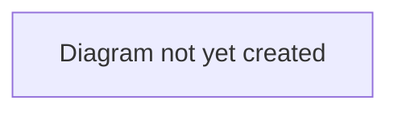

# Workflow: Negotiation & Offers

## Purpose

Describes how a listing attracts interest and how that interest becomes an agreed deal — auctions (bidding) and direct offers (negotiation).

## Scope

In scope: sale/listing types, bidding mechanics, offer/counter-offer mechanics, and how either resolves into a Deal.
Out of scope: what happens after a deal exists (see [`transfer-lifecycle.md`](./transfer-lifecycle.md)).

## Table of Contents

- [Listing types](#listing-types)
- [Auction / bidding flow](#auction--bidding-flow)
- [Direct offer flow](#direct-offer-flow)
- [Diagram](#diagram)
- [Related documents](#related-documents)

## Listing types

A selling club lists a player under one of three sale types:

| Type | Mechanic |
|---|---|
| **Auction** | Buying clubs place bids; highest bid (above any reserve price) can be accepted by the seller, or the auction closes at a deadline. |
| **Fixed Price** | The seller states a price; buying clubs make offers around it. |
| **Open to Offers** | No stated price; buying clubs propose terms directly. |

## Auction / bidding flow

> **TODO:** Describe the bidding journey from a buying club's perspective (placing a bid, being outbid, the order book) and from a selling club's perspective (reviewing bids, accepting one).

**Verified 2026-07-12.** A buying club can withdraw its own `ACTIVE` or `OUTBID` bid at any time before the sale closes (`DELETE /sales/{id}/bids/{id}`), releasing the reserved budget — previously a bid locked its full amount until the auction resolved with no way back. When a new bid beats an existing one, the beaten bid is marked `OUTBID` (informational; its reservation stays in place so the club can improve or withdraw) rather than staying indistinguishable from a still-leading bid.

Only one `OPEN` sale may exist per player at a time (auction and fixed-price listings can't run concurrently for the same player).

Accepting a bid (`POST /sales/{sale_id}/bids/{bid_id}/accept`) runs the same post-acceptance pipeline as accepting an offer, below: any other pending offer for the player is rejected, and the player's mandated agent (if any) is invited into `AGENT_NEGOTIATION`. Bid placement and acceptance are also subject to the transfer window for the seller's/buyer's association (see [`deal-completion.md`](./deal-completion.md) for where the window is checked again at completion).

## Direct offer flow

> **TODO:** Describe the offer/counter-offer journey — how an offer is made, how either side counters, and what causes an offer to expire, be withdrawn, or be accepted.

**Verified 2026-07-12.** Accepting an offer (`POST /offers/{id}/accept`) rejects every other pending offer for the same player and invites the mandated agent (if any) into `AGENT_NEGOTIATION`. It does **not** touch any separately-open auction sale for the same player — so `accept_bid` and `accept_offer` both lock the player record and check for an existing active deal before creating a new one, closing what would otherwise be a route to two accepted deals for one player (one via each path). Offer creation and acceptance are subject to the transfer window, same as bidding above.

## Diagram

> **TODO:** Add a sequence diagram for the offer/counter-offer cycle.

## Related documents

- [`transfer-lifecycle.md`](./transfer-lifecycle.md) — what happens once a bid/offer is accepted
- [`../../business/glossary.md`](../../business/glossary.md) — definitions of Sale, Bid, Offer, Order book
