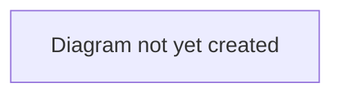

# Workflow: Negotiation & Offers

## Purpose

Describes how a listing attracts interest and how that interest becomes an agreed deal — auctions (bidding) and direct offers (negotiation).

## Scope

In scope: sale/listing types, bidding mechanics, offer/counter-offer mechanics, and how either resolves into a Deal.
Out of scope: what happens after a deal exists (see [`transfer-lifecycle.md`](./transfer-lifecycle.md)).

## Table of Contents

- [Listing types](#listing-types)
- [Auction / bidding flow](#auction--bidding-flow)
- [Direct offer flow](#direct-offer-flow)
- [Diagram](#diagram)
- [Related documents](#related-documents)

## Listing types

A selling club lists a player under one of three sale types:

| Type | Mechanic |
|---|---|
| **Auction** | Buying clubs place bids; highest bid (above any reserve price) can be accepted by the seller, or the auction closes at a deadline. |
| **Fixed Price** | The seller states a price; buying clubs make offers around it. |
| **Open to Offers** | No stated price; buying clubs propose terms directly. |

## Auction / bidding flow

> **TODO:** Describe the bidding journey from a buying club's perspective (placing a bid, being outbid, the order book) and from a selling club's perspective (reviewing bids, accepting one).

## Direct offer flow

> **TODO:** Describe the offer/counter-offer journey — how an offer is made, how either side counters, and what causes an offer to expire, be withdrawn, or be accepted.

## Diagram

> **TODO:** Add a sequence diagram for the offer/counter-offer cycle.

## Related documents

- [`transfer-lifecycle.md`](./transfer-lifecycle.md) — what happens once a bid/offer is accepted
- [`../../business/glossary.md`](../../business/glossary.md) — definitions of Sale, Bid, Offer, Order book
