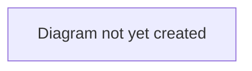

# Workflow: Negotiation & Offers

## Purpose

Describes how a listing attracts interest and how that interest becomes an agreed deal — auctions (bidding) and direct offers (negotiation).

## Scope

In scope: sale/listing types, bidding mechanics, offer/counter-offer mechanics, and how either resolves into a Deal.
Out of scope: what happens after a deal exists (see [`transfer-lifecycle.md`](./transfer-lifecycle.md)).

## Table of Contents

- [Listing types](#listing-types)
- [Listing a player](#listing-a-player)
- [Auction / bidding flow](#auction--bidding-flow)
- [Direct offer flow](#direct-offer-flow)
- [Diagram](#diagram)
- [Related documents](#related-documents)

## Listing types

A selling club lists a player under one of three sale types:

| Type | Mechanic |
|---|---|
| **Auction** | Buying clubs place bids; highest bid (above any reserve price) can be accepted by the seller, or the auction closes at a deadline. |
| **Fixed Price** | The seller states a price; buying clubs make offers around it. |
| **Open to Offers** | A price is optional, a guide rather than a requirement; buying clubs propose terms directly. |

## Listing a player

Only the club that owns a player can list him. A player on loan *to* a club is registered there, but his parent club owns him and is the one that can sell him (see [ADR 0005](../../architecture/decisions/0005-loan-registration-separate-from-ownership.md)). He cannot be listed while a transfer deal for him is in progress, or outside a transfer window when windows are configured.

A club lists a player from wherever he is: **List** on his squad row, **List for sale** on his own page, or the listings pages, which open the same form with a squad picker. The picker disables players who cannot be listed and says why. `/sales/new?player_id=` opens the form as a page, for deep links. Once a player is listed, his row shows **Listed →** and his page shows **View listing**, both linking to the listing.

- **Defaults:** Open to Offers, no price. Auction fields (reserve, minimum bid increment, and a deadline defaulted a week out) appear only for an auction.
- **The model's estimate** appears beside the price as a one-click suggestion. It is never pre-filled and is not shown for auctions. The reasons are in [product ADR 0003](../decisions/0003-listing-a-player.md).
- **A player has at most one open listing**, enforced by the database. A listing cannot be edited: to change its price or type, withdraw it and list again.

## Auction / bidding flow

> **TODO:** Describe the bidding journey from a buying club's perspective (placing a bid, being outbid, the order book) and from a selling club's perspective (reviewing bids, accepting one).

## Direct offer flow

> **TODO:** Describe the offer/counter-offer journey — how an offer is made, how either side counters, and what causes an offer to expire, be withdrawn, or be accepted.

## Diagram

```mermaid
flowchart LR
    TODO[Diagram not yet created]
```

> **TODO:** Add a sequence diagram for the offer/counter-offer cycle.

## Related documents

- [`transfer-lifecycle.md`](./transfer-lifecycle.md) — what happens once a bid/offer is accepted
- [`../../business/glossary.md`](../../business/glossary.md) — definitions of Sale, Bid, Offer, Order book
