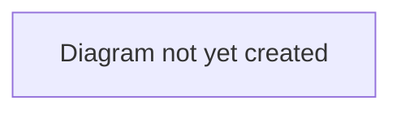

# Workflow: Transfer Lifecycle

## Purpose

Describes the end-to-end journey of a player transfer on TransferX, from a club listing a player through to a completed transfer. This is the top-level workflow that [`negotiation-and-offers.md`](./negotiation-and-offers.md), [`agent-representation.md`](./agent-representation.md), and [`deal-completion.md`](./deal-completion.md) each zoom into in more detail.

## Scope

In scope: the overall sequence and the deal stages a transfer moves through.
Out of scope: bidding/offer mechanics (see [`negotiation-and-offers.md`](./negotiation-and-offers.md)), agent negotiation detail (see [`agent-representation.md`](./agent-representation.md)), the approval process detail (see [`deal-completion.md`](./deal-completion.md)).

## Table of Contents

- [Overview](#overview)
- [Deal stages](#deal-stages)
- [Diagram](#diagram)
- [Related documents](#related-documents)

## Overview

A transfer begins with a selling club listing a player (see [`negotiation-and-offers.md`](./negotiation-and-offers.md) for how listings and bidding/offers work). Once a bid or offer is accepted, a **Deal** is created and proceeds through a sequence of stages. Where the player has an active agent mandate, the deal routes through an agent-negotiation stage before personal terms; where there is no mandate, it goes to personal terms directly. Both paths converge at `PERSONAL_TERMS` — every deal requires the player's consent before paperwork, whether or not an agent is involved.

> **Verified 2026-07-04:** this description matches the implementation. The non-mandated path previously had a regression where it skipped personal-terms consent entirely — see [`docs/CHANGELOG.md`](../../CHANGELOG.md) — fixed and covered by regression tests in `backend/tests/test_deals.py`. As of [ADR 0002](../decisions/0002-single-capture-point-for-personal-terms.md), personal terms are captured exactly once regardless of path — `AGENT_NEGOTIATION` no longer duplicates them.

## Deal stages

| Stage | Description |
|---|---|
| `AGREEMENT` | Initial stage after a bid/offer is accepted. Deal terms (fee, loan structure, clauses, instalments) can still be adjusted here. |
| `AGENT_NEGOTIATION` | Entered only when the player has an active agent mandate. The agent negotiates commission with the buying club only — see [`agent-representation.md`](./agent-representation.md). |
| `PERSONAL_TERMS` | The player reviews and consents (or declines) the proposed wage, signing bonus, and contract length — proposed by the mandated agent, or the buying club when there's no mandate. The player consents themselves if they have an account; the mandated agent may act as their proxy only if they don't. |
| `PAPERWORK` | Staff-managed documentation stage. |
| `CONFIRMED` | Documentation verified; ready for the transfer to be executed. |
| `COMPLETED` | The transfer is finalized. For a **permanent** deal the player's contract moves to the buying club. For a **loan** the registration moves but ownership does not — see [Deal types](#deal-types) below. |
| `COLLAPSED` | Terminal state reachable from most stages if either party withdraws or a required consent is declined. |

> **TODO:** Keep this table in sync with the actual stage machine as it evolves — see [`../../architecture/data-model.md`](../../architecture/data-model.md) for the authoritative technical definition.

## Deal types

Every deal carries a `deal_type`. The stage machine above is identical for all of them; what differs is what `COMPLETED` actually does.

| Type | Where it comes from | What completion does |
|---|---|---|
| `PERMANENT` | Chosen when the offer is made | The player's contract moves to the buying club permanently |
| `LOAN` | Chosen when the offer is made | The registration moves to the loanee for a fixed spell; the parent club keeps ownership and the player returns — see [Loans](#loans) |
| `FREE_TRANSFER` | Derived — created by the free-agent signing path, never offered | As permanent, with no selling club and no fee |
| `PRE_CONTRACT` | Derived — created by the pre-contract path, never offered | As permanent, executed at contract expiry |

The type is fixed when the offer is made and is **not negotiable afterwards**: countering a loan with a permanent offer is a different proposal, not a counter, and the deal room shows the type read-only. Before this was enforced, a loan could only be expressed by editing the deal *after* the seller had accepted it — so the seller agreed to one thing and was then asked to run another.

## Loans

A loan moves the registration without moving ownership, which the single-contract model cannot express directly. The mechanism — a `player_loans` row, the parent's contract suspended rather than ended, and `get_owning_club_id` answering the parent for the duration — is recorded in [ADR 0005](../../architecture/decisions/0005-loan-registration-separate-from-ownership.md).

What this means in workflow terms:

- **During the loan** the player is in the loanee's squad and on their wage bill (their agreed share of it), but the **parent club is the only one who can sell him**. The loanee is refused.
- **A loan ends** by running to its end date (a daily job returns the player automatically, with both clubs warned two weeks ahead), by an early **recall** if the terms allowed one, or by the player being bought — see below.
- **If the parent sells him mid-loan**, the loan terminates when that sale completes. Blocking the sale instead would make a loaned player unsellable for up to a year.
- **An obligation to buy** fires by itself at expiry, creating an ordinary permanent deal at the agreed price. **An option to buy** never fires by itself — the loanee has to exercise it. Either way the resulting deal passes the normal budget, medical and paperwork gates: the price was agreed when the loan was, the ability to pay it today was not.

Full specification, including the wage-split model and the decisions log: [`../../feature_spec/loan-transfers.md`](../../feature_spec/loan-transfers.md).

## Diagram

> **TODO:** Add a state diagram showing the stage transitions above, including which stages can lead to `COLLAPSED`.

## Related documents

- [`negotiation-and-offers.md`](./negotiation-and-offers.md) — how a deal comes to exist in the first place
- [`agent-representation.md`](./agent-representation.md) — detail on the `AGENT_NEGOTIATION` stage
- [`deal-completion.md`](./deal-completion.md) — detail on `PAPERWORK` → `COMPLETED`
- [`../../business/glossary.md`](../../business/glossary.md) — definitions of terms used here
