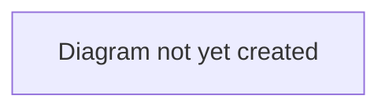

# Workflow: Transfer Lifecycle

## Purpose

Describes the end-to-end journey of a player transfer on TransferX, from a club listing a player through to a completed transfer. This is the top-level workflow that [`negotiation-and-offers.md`](./negotiation-and-offers.md), [`agent-representation.md`](./agent-representation.md), and [`deal-completion.md`](./deal-completion.md) each zoom into in more detail.

## Scope

In scope: the overall sequence and the deal stages a transfer moves through.
Out of scope: bidding/offer mechanics (see [`negotiation-and-offers.md`](./negotiation-and-offers.md)), agent negotiation detail (see [`agent-representation.md`](./agent-representation.md)), the approval process detail (see [`deal-completion.md`](./deal-completion.md)).

## Table of Contents

- [Overview](#overview)
- [Deal stages](#deal-stages)
- [Diagram](#diagram)
- [Related documents](#related-documents)

## Overview

A transfer begins with a selling club listing a player (see [`negotiation-and-offers.md`](./negotiation-and-offers.md) for how listings and bidding/offers work). Once a bid or offer is accepted, a **Deal** is created and proceeds through a sequence of stages. Where the player has an active agent mandate, the deal routes through an agent-negotiation stage before personal terms; where there is no mandate, it goes to personal terms directly. Both paths converge at `PERSONAL_TERMS` — every deal requires the player's consent before paperwork, whether or not an agent is involved.

> **Verified 2026-07-04:** this description matches the implementation. The non-mandated path previously had a regression where it skipped personal-terms consent entirely — see [`docs/CHANGELOG.md`](../../CHANGELOG.md) — fixed and covered by regression tests in `backend/tests/test_deals.py`. As of [ADR 0002](../decisions/0002-single-capture-point-for-personal-terms.md), personal terms are captured exactly once regardless of path — `AGENT_NEGOTIATION` no longer duplicates them.

> **Verified 2026-07-12:** until the 2026-07-11 audit remediation, this convergence only held for the *offer* path — a player sold at auction (`accept_bid`) never routed through `AGENT_NEGOTIATION` at all, and a rival direct offer for the same player could still be accepted afterward, creating two `IN_PROGRESS` deals. `accept_bid` now runs the same post-acceptance pipeline as `accept_offer` (reject rival offers for the player, invite the mandated agent if one exists), so the description above now genuinely holds for both listing types. See [`negotiation-and-offers.md`](./negotiation-and-offers.md) for the listing-type detail.

## Deal stages

| Stage | Description |
|---|---|
| `AGREEMENT` | Initial stage after a bid/offer is accepted. Deal terms (fee, loan structure, clauses, instalments) can still be adjusted here. |
| `AGENT_NEGOTIATION` | Entered only when the player has an active agent mandate. The agent negotiates commission with the buying club only — see [`agent-representation.md`](./agent-representation.md). |
| `PERSONAL_TERMS` | The player reviews and consents (or declines) the proposed wage, signing bonus, and contract length — proposed by the mandated agent, or the buying club when there's no mandate. The player consents themselves if they have an account; the mandated agent may act as their proxy only if they don't. |
| `PAPERWORK` | Staff-managed documentation stage. Requires a recorded medical outcome (passed or explicitly waived by the buying club) to advance — see [`deal-completion.md`](./deal-completion.md). |
| `CONFIRMED` | Documentation verified; ready for the transfer to be executed. Completion also requires the transfer window to be open (or a deadline-day grace period to still apply) — see [`deal-completion.md`](./deal-completion.md). |
| `COMPLETED` | The transfer is finalized — the player's contract moves to the buying club, built from the terms the player actually consented to (see [`deal-completion.md`](./deal-completion.md)). |
| `COLLAPSED` | Terminal state — reached only by an explicit `POST /deals/{id}/collapse`, never automatically from a declined personal-terms or commission proposal (a decline resets that proposal for revision instead — see [`agent-representation.md`](./agent-representation.md)). Collapsing a deal at `CONFIRMED` or later requires a recorded reason from non-staff actors. |

> **TODO:** Keep this table in sync with the actual stage machine as it evolves — see [`../../architecture/data-model.md`](../../architecture/data-model.md) for the authoritative technical definition.

## Diagram

> **TODO:** Add a state diagram showing the stage transitions above, including which stages can lead to `COLLAPSED`.

## Related documents

- [`negotiation-and-offers.md`](./negotiation-and-offers.md) — how a deal comes to exist in the first place
- [`agent-representation.md`](./agent-representation.md) — detail on the `AGENT_NEGOTIATION` stage
- [`deal-completion.md`](./deal-completion.md) — detail on `PAPERWORK` → `COMPLETED`
- [`../../business/glossary.md`](../../business/glossary.md) — definitions of terms used here
