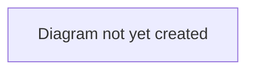

# Workflow: Transfer Lifecycle

## Purpose

Describes the end-to-end journey of a player transfer on TransferX, from a club listing a player through to a completed transfer. This is the top-level workflow that [`negotiation-and-offers.md`](./negotiation-and-offers.md), [`agent-representation.md`](./agent-representation.md), and [`deal-completion.md`](./deal-completion.md) each zoom into in more detail.

## Scope

In scope: the overall sequence and the deal stages a transfer moves through.
Out of scope: bidding/offer mechanics (see [`negotiation-and-offers.md`](./negotiation-and-offers.md)), agent negotiation detail (see [`agent-representation.md`](./agent-representation.md)), the approval process detail (see [`deal-completion.md`](./deal-completion.md)).

## Table of Contents

- [Overview](#overview)
- [Deal stages](#deal-stages)
- [Diagram](#diagram)
- [Related documents](#related-documents)

## Overview

A transfer begins with a selling club listing a player (see [`negotiation-and-offers.md`](./negotiation-and-offers.md) for how listings and bidding/offers work). Once a bid or offer is accepted, a **Deal** is created and proceeds through a sequence of stages. Where the player has an active agent mandate, the deal routes through an agent-negotiation stage before personal terms; where there is no mandate, it proceeds directly.

> **TODO:** Confirm this description against current behaviour before treating it as final — the non-mandated path in particular should be reviewed, as it is an area of active work.

## Deal stages

| Stage | Description |
|---|---|
| `AGREEMENT` | Initial stage after a bid/offer is accepted. Deal terms (fee, loan structure, clauses, instalments) can still be adjusted here. |
| `AGENT_NEGOTIATION` | Entered only when the player has an active agent mandate. The agent negotiates commission with the buying club and personal terms with the player in parallel. |
| `PERSONAL_TERMS` | The player reviews and consents (or declines) the proposed wage, signing bonus, and contract length. |
| `PAPERWORK` | Staff-managed documentation stage. |
| `CONFIRMED` | Documentation verified; ready for the transfer to be executed. |
| `COMPLETED` | The transfer is finalized — the player's contract moves to the buying club. |
| `COLLAPSED` | Terminal state reachable from most stages if either party withdraws or a required consent is declined. |

> **TODO:** Keep this table in sync with the actual stage machine as it evolves — see [`../../architecture/data-model.md`](../../architecture/data-model.md) for the authoritative technical definition.

## Diagram

> **TODO:** Add a state diagram showing the stage transitions above, including which stages can lead to `COLLAPSED`.

## Related documents

- [`negotiation-and-offers.md`](./negotiation-and-offers.md) — how a deal comes to exist in the first place
- [`agent-representation.md`](./agent-representation.md) — detail on the `AGENT_NEGOTIATION` stage
- [`deal-completion.md`](./deal-completion.md) — detail on `PAPERWORK` → `COMPLETED`
- [`../../business/glossary.md`](../../business/glossary.md) — definitions of terms used here
